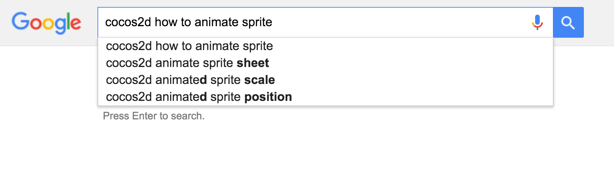

---
title: "The Ultimate Lessons"
slug: ultimate-lessons
---     

##Ultimate Lesson 1: Google

Here's the most valuable thing we could teach you, right up front. When you get stuck, realize that at least thousands, probably tens of thousands, possibly hundreds of thousands of people have run into the same problem.

Therefore, when you run into a problem, no matter how obscure it seems to be, Google it. Have a crazy error? Paste it into Google. If that fails, of course e-mail us - <hello@makeschool.com> is here to help :)

##Ultimate Lesson 2: Read the Code

We're going to show you how to do a lot of different things. You're going to be copy-and-pasting a lot of code. Read the code! That's the only way you'll learn. Read the comments - we explain a lot of things in them.