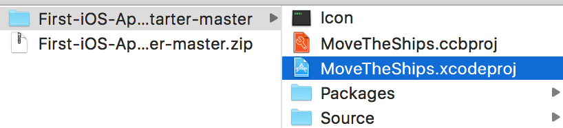
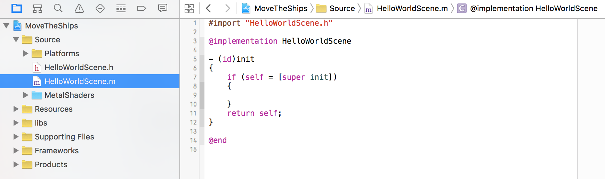

---
title: "Create The Ships!"
slug: create-the-ships
---     

##Step 1: Download the base project

First download our empty template project.

After the download completes, unzip the folder and open the contained project by double-clicking:



Once Xcode has opened the project, select the MGWU/Classes folder and open HelloWorldScene.m (single click it, double clicking it opens it in a new window – we don't want that):



##Step 2: Start Coding!

Right under the #import line, paste the following lines in:

```
CCSprite *ship1;
CCSprite *ship2;
```

This command creates a sprite. In video game developer-speak, sprites are images from which an in-game object is drawn.

##Step 3: Initialize the Ships!

Now, after:

```
if ((self = [super init]))
{
```

replace everything in between the inner two curly brackets with:

```
//Initialize the ship sprite with a specific file, the ship image
ship1 = [CCSprite spriteWithImageNamed: @"ship.png"];

//Set the ship's position. (0,0) is at the bottom left
ship1.position = ccp( 50, 200 );

//Initialize the other sprite
ship2 = [CCSprite spriteWithImageNamed: @"ship.png"];

//Set the other ship's position
ship2.position = ccp( 100, 50 );

//Add the ships to the game
[self addChild:ship1];
[self addChild:ship2];
```

Your code should now look like this:

```
- (id)init
{
    if (self = [super init])
    {
        //Initialize the ship sprite with a specific file, the ship image
        ship1 = [CCSprite spriteWithImageNamed: @"ship.png"];

        //Set the ship's position. (0,0) is at the bottom left
        ship1.position = ccp( 50, 200 );

        //Initialize the other sprite
        ship2 = [CCSprite spriteWithImageNamed: @"ship.png"];

        //Set the other ship's position
        ship2.position = ccp( 100, 50 );

        //Add the ships to the game
        [self addChild:ship1];
        [self addChild:ship2];
    }

    return self;
}
```

Run it and see what happens!
